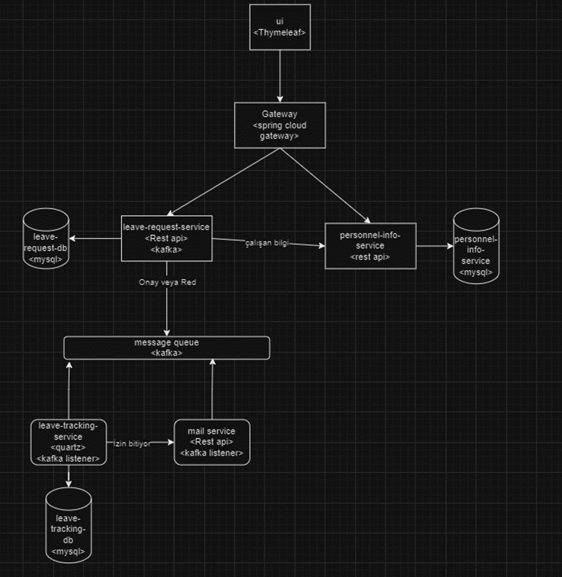
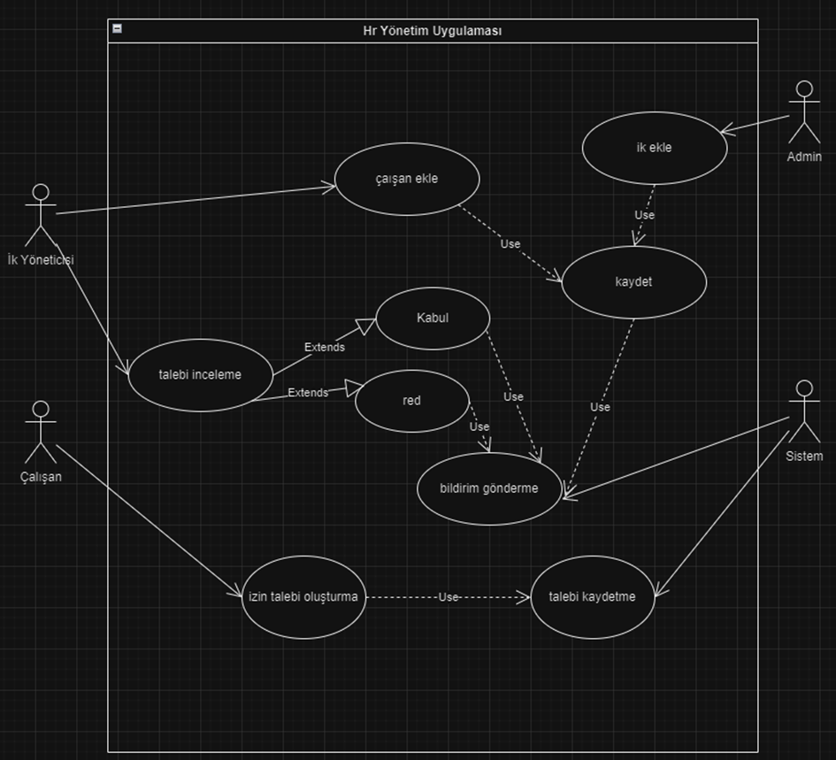

# HR Employee and Leave Management System

This project is a microservices-based HR (Human Resources) Management System designed for corporate environments to track employee leaves, manage personnel information, and send notifications.

## Overview

The system consists of various microservices to handle different HR management components such as employee management, leave request processing, and notification services. The main goal is to provide a scalable and modular solution that enables seamless interaction among administrators, HR managers, and employees.

## Features

### 1. Employee Profile Management
- Add and remove employees.
- Update employee information (name, department, position, contact details, etc.).

### 2. Leave Management
- Define various types of leaves (annual leave, sick leave, etc.).
- Create, approve, or reject leave requests for employees.

### 3. Notifications
- Send email notifications to employees about the status of their leave requests.

## User Roles and Key Functions

- **Admin:**
    - Add/remove HR managers.
    - Manage user roles and permissions.
- **HR Manager:**
    - Add/remove employees.
    - Update employee information.
    - Approve/reject leave requests.
- **Employee:**
    - View and update their profile information.
    - Create leave requests.
    - View leave status and remaining leave days.

## Technologies and Libraries Used

- **UI (Thymeleaf):** Used for developing the user interface. It has a natural integration with Spring Boot.
- **Spring Cloud Gateway:** Serves as the API Gateway and routes incoming requests to the relevant microservices.
- **Eureka Server:** Used for service discovery and allows microservices to find each other.
- **Kafka:** Provides asynchronous messaging between microservices.
- **MySQL:** Used for database management.
- **Quartz Scheduler:** Used for scheduled tasks.

## Microservices

### 1. Leave Request Service
- Manages leave requests.
- **Technologies:** Spring Boot, REST API, Kafka, MySQL.

### 2. Employee-HR-Admin Service
- Manages employee information.
- **Technologies:** Spring Boot, REST API, MySQL.

### 3. Leave Tracking Service
- Tracks leave status and sends notifications.
- **Technologies:** Quartz, Kafka Listener, MySQL.

### 4. Mail Service
- Sends email notifications.
- **Technologies:** Spring Boot, REST API, Kafka Listener.

## API Endpoints and Data Models

### Leave Request Service
- Create a leave request (Employee):
    - `POST http://localhost:8080/leave-request`

- View all leave requests (HR Manager):
    - `GET http://localhost:8080/leave-request`

- Approve or reject a leave request (HR Manager):
    - `POST http://localhost:8080/leave-request/accept`
    - `POST http://localhost:8080/leave-request/reject`

- Employee views their own leave requests:
    - `GET http://localhost:8080/leave-request/{user_id}`

### Personnel Info Service
- View all personnel:
    - `GET http://localhost:8080/personnel-info`

- View specific personnel:
    - `GET http://localhost:8080/personnel-info/{personnel_id}`

- Add and update personnel:
    - `POST http://localhost:8080/personnel-info`
    - `POST http://localhost:8080/personnel-info/update`

## Project Structure and Flow

1. **UI -> Gateway -> Leave Request Service:**
    - User creates a leave request, and it is saved to the database.
    - A message is sent to Kafka.

2. **Kafka -> Employee HR Admin Service:**
    - Leave request status (approved or rejected) is sent to Kafka.

3. **Kafka -> Leave Tracking Service and Mail Service:**
    - The leave tracking service creates scheduled tasks.
    - The mail service sends notifications regarding the leave status.

## Setup and Running

1. Install the requirements: `Java 11+`, `Maven`, `MySQL`.
2. Configure the necessary settings to run the microservices.
3. Use the command `mvn clean install` to build and run the entire project.
4. Start the application by running the main class of each microservice.

## Usage

To access different parts of the UI, you can use the following URLs:

- **Employee UI:**  
  `http://localhost:8080/ui/employee/{userId}?token={token}&userId={userId}`  
  Used by employees to manage their profile and leave requests.
    

- **Admin UI:**  
  `http://localhost:8080/ui/admin/{userId}?token={token}&userId={userId}`  
  Used by admins to manage HR managers and employee roles.
    
    
    

- **HR Manager UI:**  
  `http://localhost:8080/ui/hr/{userId}?token={token}&userId={userId}`  
  Used by HR managers to handle employee information and approve/reject leave requests.
        
    

## Project Structure and Flow

## Visuals

The following diagrams illustrate the project design and structure:

- **System Services**
  
- **Use Cases**

- **DB Designs** 
- 

## Development Process

1. Requirement Analysis and Planning
2. System Design
3. Application Development
4. Testing and Integration
5. Deployment and Maintenance

## Contribution

Please submit a `pull request` to contribute.

## License

This project is licensed under the MIT License. For more information, see the `LICENSE` file.
